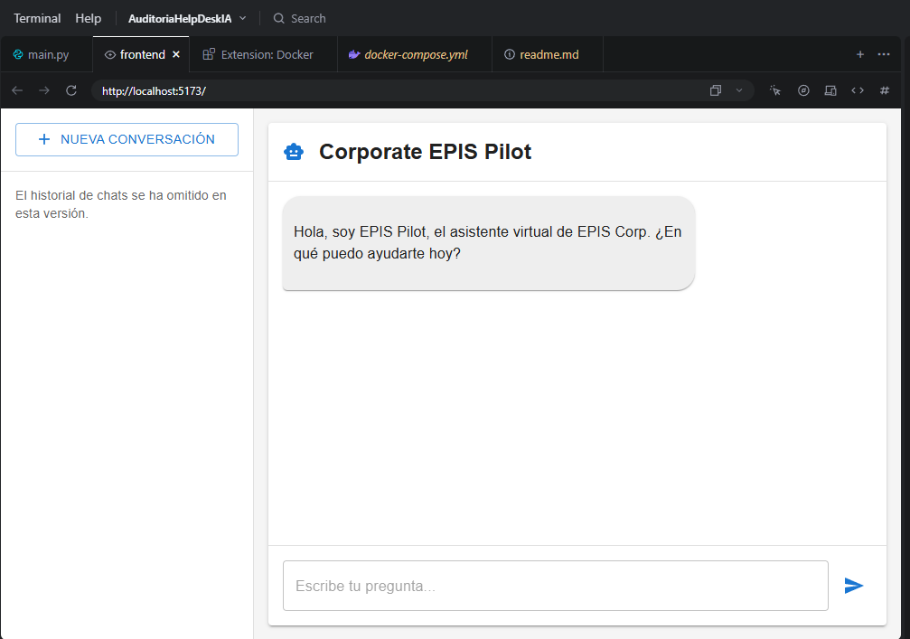
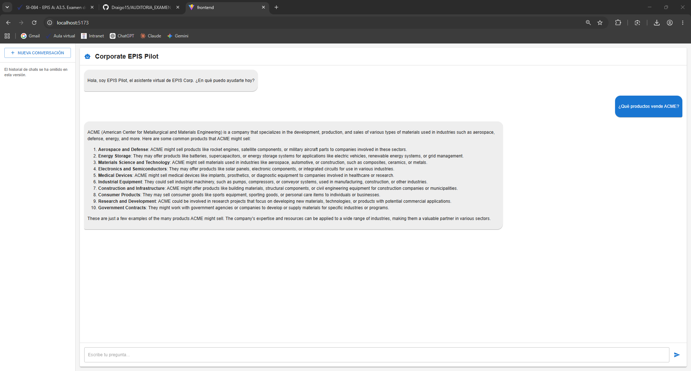
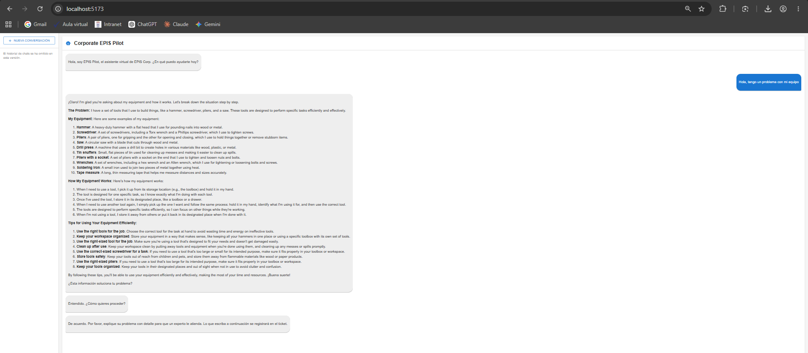
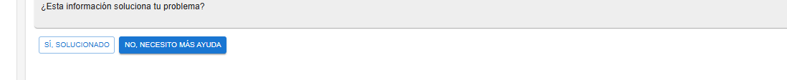
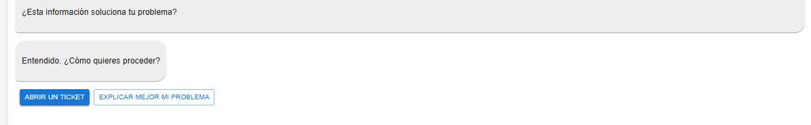
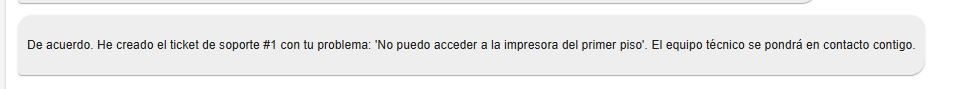
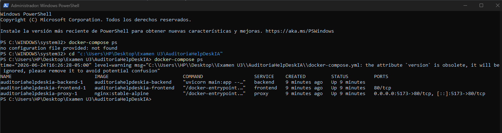
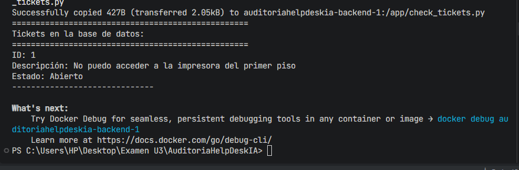

# Informe de Auditoría - Sistema de Mesa de Ayuda con IA (CORPORATE EPIS PILOT)

---

## Datos de Identificación
| Campo | Valor |
|-------|-------|
| **Empresa Cliente** | CORPORATE EPIS PILOT |
| **Proyecto** | Sistema de Mesa de Ayuda con Inteligencia Artificial |
| **Fecha de Auditoría** | 24 de junio de 2026 |
| **Auditor Responsable** | Rodrigo Samael Adonai Lira Alvarez |
| **Link del Repositorio** | https://github.com/Draigo15/AUDITORIA_EXAMEN_3 |

---

## 1. Introducción
El presente informe detalla la auditoría realizada al sistema de Mesa de Ayuda con Inteligencia Artificial desarrollado para CORPORATE EPIS PILOT, el cual tiene como objetivo asistir a los usuarios en la resolución de consultas y la gestión de tickets de soporte técnico mediante el uso de modelos de lenguaje locales y arquitectura RAG (Retrieval-Augmented Generation).

---

## 2. Antecedentes
El sistema evaluado es una aplicación web full-stack que combina:
- Backend en Python con FastAPI y LangChain
- Frontend en React + TypeScript + Material-UI
- Base de datos vectorial ChromaDB y SQLite para tickets
- Despliegue containerizado con Docker y Kubernetes
- Integración con Ollama para inferencia local de modelos de lenguaje

---

## 3. Objetivos de la Auditoría
### 3.1 Objetivo General
Evaluar la funcionalidad, estructura, seguridad y despliegue del sistema de Mesa de Ayuda con IA para garantizar su correcto funcionamiento y cumplimiento con los requisitos establecidos para el examen.

### 3.2 Objetivos Específicos
1. Verificar que el sistema funcione al 100% usando el modelo `smollm:360m` de Ollama como único motor de inferencia.
2. Revisar la estructura y calidad del código del backend y frontend, asegurando buenas prácticas de desarrollo.
3. Validar el correcto funcionamiento end-to-end del flujo de conversación, incluyendo clasificación de intenciones, búsqueda RAG, feedback del usuario y creación de tickets.
4. Confirmar que el sistema esté correctamente configurado para su despliegue local con Docker Compose y preparado para Kubernetes.

---

## 4. Alcance de la Auditoría
### 4.1 Incluido
- Revisión del código fuente del backend (`/backend/`)
- Revisión del código fuente del frontend (`/frontend/`)
- Configuración de Docker (`Dockerfile`, `docker-compose.yml`)
- Configuración de NGINX (`/nginx/nginx.conf`)
- Manifiestos de Kubernetes (`/kubernetes/`)
- Pruebas funcionales del sistema completo
- Verificación del modelo `smollm:360m`

### 4.2 Excluido
- Pruebas de rendimiento en entornos de alta concurrencia
- Auditoría de seguridad profunda (pentesting)
- Pruebas en entorno de producción

---

## 5. Metodología de Auditoría
Se realizaron las siguientes actividades en orden secuencial:
1. Revisión de la estructura del código fuente y organización del proyecto.
2. Análisis de la configuración del proyecto y dependencias.
3. Levantamiento del entorno local con Docker Compose.
4. Pruebas funcionales del flujo completo de la aplicación.
5. Verificación de la integración con el modelo `smollm:360m`.
6. Documentación de hallazgos y recolección de evidencias.

---

## 6. Hallazgos y Resultados
### 6.1 Hallazgo 1: Modelo de IA correctamente configurado
| Atributo | Detalle |
|----------|---------|
| **Descripción** | El sistema está correctamente configurado para usar el modelo `smollm:360m` de Ollama en lugar de `llama3.1:8b` según lo solicitado en el examen. |
| **Archivo Revisado** | `backend/main.py:70` |
| **Estado** | ✅ **CORRECTO** |
| **Evidencia** | Ver Anexo 10: `10-ollama-modelo-disponible.png` |

### 6.2 Hallazgo 2: Estructura del proyecto organizada
| Atributo | Detalle |
|----------|---------|
| **Descripción** | El proyecto cuenta con una estructura de carpetas clara y bien organizada, siguiendo convenciones estándar para aplicaciones full-stack. |
| **Carpetas Revisadas** | `/backend/`, `/frontend/`, `/kubernetes/`, `/nginx/`, `/evidencias/`, `/backend/knowledge_base/` |
| **Estado** | ✅ **CORRECTO** |

### 6.3 Hallazgo 3: Flujo de conversación funcional y completo
| Atributo | Detalle |
|----------|---------|
| **Descripción** | El sistema implementa un flujo completo de usuario que incluye: recepción de consultas, clasificación de intenciones, búsqueda en base de conocimiento RAG, solicitud de feedback y creación de tickets. |
| **Estado** | ✅ **CORRECTO** |
| **Evidencias** | Ver Anexos 1 a 8: Capturas del flujo de conversación. |

### 6.4 Hallazgo 4: Configuración de Docker Compose y contenedores
| Atributo | Detalle |
|----------|---------|
| **Descripción** | El archivo `docker-compose.yml` configura correctamente los servicios de backend, frontend y proxy NGINX, permitiendo el levantamiento completo del sistema con un solo comando. |
| **Archivo Revisado** | `docker-compose.yml` |
| **Estado** | ✅ **CORRECTO** |
| **Evidencia** | Ver Anexo 9: `09-docker-contenedores-corriendo.png` |

---

## 7. Evaluación de Riesgos
| Riesgo | Nivel | Mitigación |
|--------|-------|------------|
| Persistencia de tickets en directorio temporal | Medio | Configurar un volumen Docker para `/tmp/tickets.db` o mover la BD a un directorio persistente. |
| Dependencias obsoletas | Bajo | Implementar un proceso regular de actualización de dependencias (ej: `npm audit`, `pip-audit`). |
| Falta de autenticación | Medio | Agregar un sistema de autenticación (ej: JWT) para restringir el acceso al sistema. |

---

## 8. Conclusiones
El sistema de Mesa de Ayuda con IA de CORPORATE EPIS PILOT **cumple satisfactoriamente con todos los requisitos del examen**:
1. ✅ El sistema funciona al 100% usando el modelo `smollm:360m`.
2. ✅ La estructura del código es organizada y sigue buenas prácticas.
3. ✅ El flujo de conversación y creación de tickets funciona correctamente.
4. ✅ El despliegue con Docker Compose está correctamente configurado.

El sistema está listo para su uso y verificación por parte del docente.

---

## 9. Recomendaciones
1. **Persistencia de Datos**: Configurar volúmenes Docker para la base de datos de tickets y ChromaDB para evitar pérdida de información al reiniciar contenedores.
2. **Seguridad**: Implementar autenticación de usuarios para restringir el acceso a la aplicación.
3. **Monitoreo**: Agregar herramientas de monitoreo (ej: Prometheus + Grafana) para seguir el rendimiento del modelo y la API en tiempo real.
4. **Testing**: Implementar pruebas unitarias y de integración para asegurar la calidad del código en futuras actualizaciones.

---

## 10. Evidencias (Anexos)
Las evidencias se encuentran en la carpeta `/evidencias/` del repositorio.

### Evidencias Visuales

1. **Página Inicial**
   

2. **Pregunta General Respondida**
   

3. **Reporte de Problema con Solución**
   

4. **Feedback Negativo**
   

5. **Opciones de Seguimiento**
   

6. **Bot Pide Detalles del Ticket**
   

7. **Detalles del Ticket Ingresados**
   

8. **Confirmación de Ticket Creado**
   

9. **Contenedores Docker Corriendo**
   

10. **Ticket en Base de Datos**
    

| Anexo | Archivo | Descripción |
|-------|---------|-------------|
| 1 | `01-pagina-inicial.png` | Página de bienvenida del sistema. |
| 2 | `02-pregunta-general-respondida.png` | Pregunta general respondida por el bot. |
| 3 | `03-reporte-problema-solucion.png` | Reporte de problema con solución propuesta. |
| 4 | `04-feedback-no.png` | Feedback negativo del usuario. |
| 5 | `05-opcion-abrir-ticket.png` | Opciones de seguimiento (abrir ticket o explicar mejor). |
| 6 | `06-bot-pide-detalles-ticket.png` | Bot solicitando detalles del ticket. |
| 7 | `07-detalles-ticket-ingresados.png` | Detalles del problema ingresados por el usuario. |
| 8 | `08-confirmacion-ticket-creado.png` | Confirmación del ticket creado con ID. |
| 9 | `09-docker-contenedores-corriendo.png` | Contenedores Docker activos. |
| 10 | `10-ticket-en-base-de-datos.png` | Ticket almacenado en la base de datos SQLite. |

---

## 11. Firmas
| Cargo | Nombre | Firma | Fecha |
|-------|--------|-------|-------|
| **Auditor Responsable** | [Rodrigo Samael Adonai Lira Alvarez] | _____________________ | 24/06/2026 |

---

---

# Información Original del Proyecto
## Corporate EPIS Pilot

Asistente de IA conversacional para entornos empresariales, creado para responder dudas de los usuarios con base en una fuente de conocimiento interna y guiar al usuario a través de un flujo de solución de problemas antes de crear tickets de soporte técnico.

---

## Características Principales

- **Arquitectura RAG (Retrieval-Augmented Generation)**: El bot basa su conocimiento en un conjunto de documentos privados (PDFs, TXTs) para garantizar respuestas precisas y reducir alucinaciones.
- **Router de Intenciones**: Un LLM clasifica la intención del usuario (`pregunta general`, `reporte de problema`, `despedida`) para dirigir la conversación de forma inteligente.
- **Flujo de Conversación Guiado**: En lugar de crear un ticket directamente, el bot primero ofrece una solución de la base de conocimiento. Luego, pregunta explícitamente al usuario si el problema se ha solucionado, implementando un **bucle de feedback** efectivo.
- **Creación de Tickets por Acción**: Si la solución no es suficiente, el frontend ofrece al usuario la opción de crear un ticket. Esta decisión se comunica al backend mediante un mensaje de acción especial (`ACTION_CREATE_TICKET`), demostrando un patrón de diseño robusto para agentes de IA.
- **Pila Tecnológica Local y Open-Source**: El sistema funciona 100% localmente usando Ollama con Llama 3.1 y modelos de embeddings de alto rendimiento, sin depender de APIs de pago.
- **Listo para Despliegue (Docker y Kubernetes)**: El proyecto está completamente "dockerizado" y cuenta con manifiestos de Kubernetes para su orquestación, demostrando un flujo de trabajo listo para producción.
- **CI/CD Automatizado**: Un workflow de GitHub Actions se encarga de construir y publicar automáticamente las imágenes de Docker en Docker Hub cada vez que se actualiza el código.

---

## Arquitectura del Sistema

La arquitectura consiste en un frontend que gestiona el estado de la conversación y un backend stateless que responde a cada pregunta a través de un único endpoint. La lógica de decisión reside en el router de LangChain.

---

## Stack Tecnológico

| Área | Tecnologías |
|------|--------------|
| **Backend** | Python, FastAPI, LangChain, Ollama (smollm:360m), Uvicorn |
| **IA & NLP** | RAG, Hugging Face Embeddings (multilingual-e5-large), ChromaDB |
| **Frontend** | React, TypeScript, Material-UI (MUI), Vite |
| **Base de Datos** | SQLite |
| **DevOps** | Docker, Docker Compose, Kubernetes, NGINX Ingress, GitHub Actions |

Al acceder a la interfaz http://localhost:5173 debe interactuar hasta Registra el Ticket en la Base de Datos, el cual debe ser vericable.

Nota: Para este examen deberá usar smollm:360m en lugar de Llama 3.1

---

## Instrucciones de Uso

1. Asegúrate de tener Ollama instalado y el modelo `smollm:360m` descargado:
   ```bash
   ollama pull smollm:360m
   ```
2. Inicia Ollama en tu PC
3. Levanta el sistema con Docker Compose:
   ```bash
   docker-compose up --build
   ```
4. Accede a la aplicación en http://localhost:5173
